# CHAPTER 1: Introduction to Virtual Reality

## AIM
- To understand what Virtual Reality (VR) is. 
- To understand the basic components of VR. 
- To learn the basic setup of VR.

## Theory
1. Introduction to Virtual Reality and understanding the fundamentals of Virtual reality.

### What is Virtual Reality? 
---
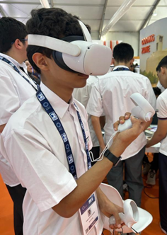

#### Definition

Virtual Reality (VR) is the fusion of two contrasting words, 'virtual' and 'reality,' encapsulating the essence of the experience it offers. It entails immersing oneself in a simulated world that feels convincingly real, facilitated by technology that tricks our senses into believing we inhabit an alternate reality. In essence, VR enables the sensation of genuine presence within a fabricated yet lifelike environment.

In other words, Virtual reality (VR) is a computer-generated simulation of an environment or experience that immerses users in a three-dimensional, interactive world. It's designed to stimulate the senses, creating an artificial environment that can be explored and interacted with as if it were real. VR typically involves the use of a headset or goggles that display a virtual environment to the user, often coupled with specialized gloves or controllers to enable interaction within that environment. This technology has applications in gaming, education, training, healthcare, and various other industries, offering immersive and often highly engaging experiences.

#### Components of VR

The detailed breakdown of the components that make up a typical Virtual Reality (VR) system:

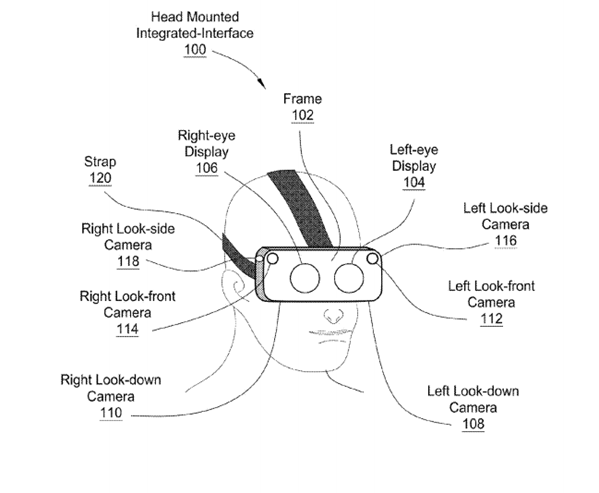

NVIDIA VR Headset Patent Found - PC Perspective

1. Head-Mounted Display (HMD):
   - The HMD is the primary hardware for VR, worn on the head like goggles or a helmet.
   - It contains small screens or lenses to display stereoscopic 3D images, creating the visual experience.
   - Some HMDs also have built-in sensors for head tracking, allowing the system to adjust the displayed images based on the user's movements.

2. Tracking System:
   - Sensors or cameras track the user's movements and location in physical space.
   - Inside-out tracking uses sensors on the HMD to monitor the user's movements without external devices.
   - Outside-in tracking relies on external cameras or sensors placed in the environment to track the user's position and movements.

3. Controllers and Input Devices:
--- 
   
---   
   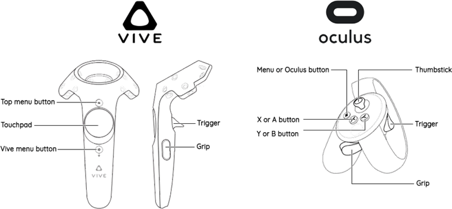
---
   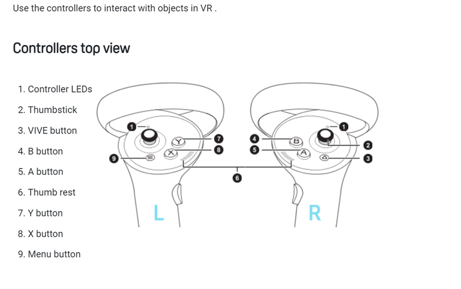
---
   - Handheld controllers or gloves allow users to interact with the virtual environment.
   - These devices can simulate hand movements, gestures, and manipulation of objects within the VR space.

4. Audio System:
   - Quality audio output enhances immersion by providing spatial, 3D audio cues.
   - Surround sound headphones or speakers create a sense of presence by delivering realistic sounds from different directions.

5. Graphics Processing Unit (GPU):
   - Powerful computers or devices equipped with high-end GPUs render high-quality, real-time graphics for a smooth and immersive experience.
   - GPUs handle the complex calculations required to generate the detailed visuals in VR.

6. Software and Applications:
   - VR experiences, games, simulations, and applications specifically designed for VR.
   - These programs run on compatible platforms and offer a wide range of virtual experiences.

7. Haptic Feedback Devices:
    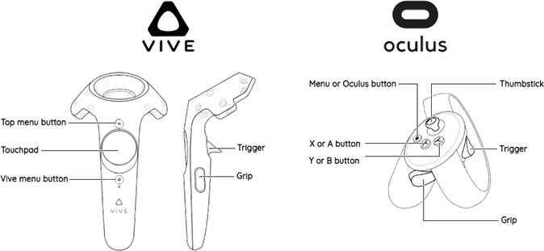
 
   - Haptic technology provides tactile feedback, allowing users to feel sensations within the virtual environment.
   - Devices such as gloves or vests use vibrations, pressure, or other methods to simulate the sense of touch.

8. Peripherals & Cables: 
   1.	USB TypeC
---
   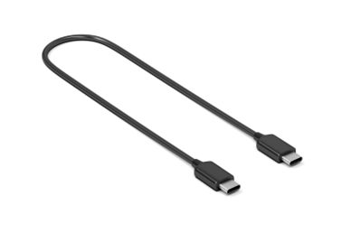

   2.	HDMI/Mini Display Port/Display Port Cable   
---   
   
---
   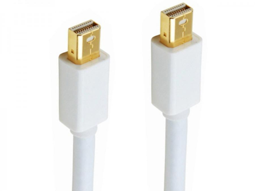
---
   
---
   3.	MicroUSB
---
   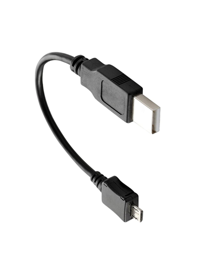
---
   WiFi
---
   Input and Output Connector (I/O Hub)
---

---
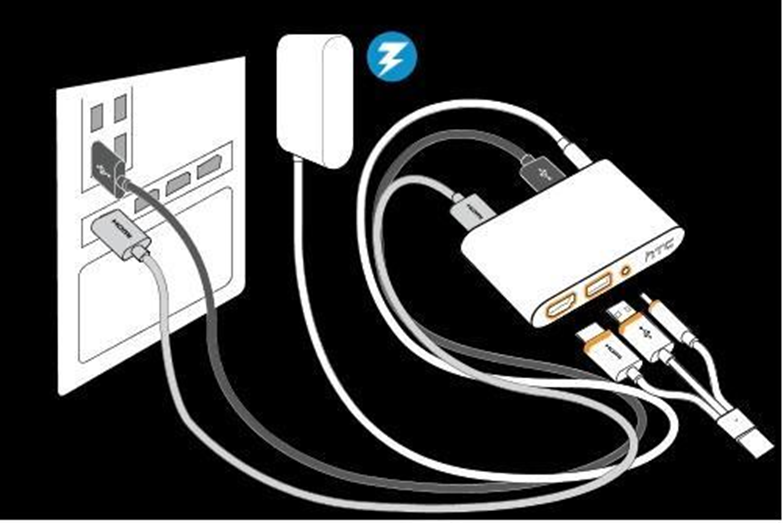

## Pre Test

1.	IDENTIFY VR Components

2. Complete the 4 step VR Process Cycle
    1.	Virtual Environment-2. ______________? 3. Hardware 4.  _______________?

Answer: <code style="color : green">2. Interaction 4. Software</code>

3. The Viewing Angle of VR is 
---
Option 1: 180 degree Horizontal 90 degree vertical 
Option 2: 45 degree Horizontal 180 degree vertical 
Option 3: 90 degree Horizontal 90 degree vertical
Option 4: 180 degree horizontal 360 vertical

### Procedure
VR SET UP:
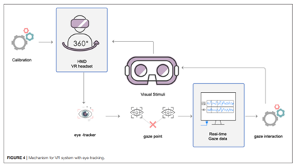
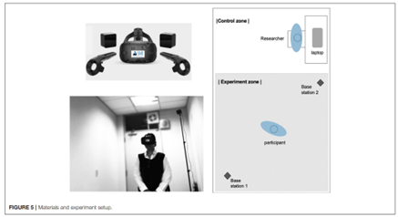
Connecting a virtual reality (VR) system typically involves several steps, and the specific process may vary depending on the type of VR hardware you're using. Below are general steps to connect a VR system:

1. Set Up VR Hardware:
   - Unbox your VR headset and controllers.
   - Connect any necessary cables to the VR headset (e.g., HDMI, USB, power).
   - If your VR system requires external sensors or base stations, place them in appropriate locations and connect them to power.

2. Install VR Software:
   - Download and install the VR software or platform that corresponds to your VR headset. Common platforms include SteamVR, Oculus Home, or Windows Mixed Reality for different VR devices.

3. Connect VR Headset to PC or Console:
   - Connect the VR headset to your computer or gaming console using the provided cables.
   - Make sure your computer meets the minimum system requirements for the VR headset.

4. Setup Tracking:
   - If your VR system uses external sensors or base stations, make sure they are properly positioned to track your movements.
   - Follow any on-screen instructions to calibrate or set up tracking.

5. Update Drivers and Firmware:
   - Check for and install any firmware updates for your VR headset, controllers, and sensors. Also, ensure that your graphics drivers are up to date.

6. Pair Controllers:
   - Follow the instructions to pair your VR controllers with the VR headset or your computer/console. This often involves holding down specific buttons or following prompts in the VR setup software.

7. Room Setup:
   - Some VR systems may require you to define your play area or room boundaries. Follow the on-screen instructions to set up the virtual boundaries, ensuring you have enough space to move around safely.

8. Configure Audio:
   - Set up the audio output for your VR experience. This may involve using headphones connected to the VR headset or configuring the audio settings within the VR software.

9. Test the System:
   - Launch a VR application or game to test the system. Ensure that the VR headset display is working correctly, and the controllers are responding accurately.

10. Adjust Settings:
    - Fine-tune any settings within the VR software to optimize your experience, such as graphics quality, comfort settings, or controller configurations.

Note: 
-	Remember that these steps are general guidelines, and the specific steps may vary based on the brand and model of your VR hardware. Always refer to the manufacturer's instructions for your specific VR system for the most accurate information.
-	Some VR systems support networking capabilities, enabling multiple users to share the same virtual space.
-	This allows for collaborative experiences or social interactions within the VR environment.
-	Each of these components contributes to creating a cohesive VR experience, engaging multiple senses to immerse users in a convincingly realistic virtual world.

About  Virtual World:

A Virtual World is a simulated realm crafted for user experience within a VR system. Its components vary based on its intended purpose, evolving from the creator's concepts brought to life through computer programs. The depth of immersion in a VR encounter hinges on the virtual world's responsiveness to user interactions, continually updating itself to engage users more profoundly.

• Interaction:
The credibility of any virtual realm hinges on its responsiveness to user actions. When a VR system allows extensive interaction possibilities within a virtual space, users instinctively respond to objects, characters, and the environment. These interactions manifest through sensory inputs or physical movements within the imagined space. Acting as a conduit, the computer system collects and interprets these inputs, continually updating the virtual world accordingly.

• Hardware:
The hardware constitutes the physical apparatus facilitating a user's engagement in a VR experience. Head-mounted displays, cameras, and position-tracking sensors exemplify typical hardware components. These devices capture user interactions, often in sensory formats, and relay this information to the computer system (software) for updating the virtual world.

• Software:
Software encompasses the computational elements used to create, modify, and manage the virtual world based on user interactions. The effectiveness of a virtual environment heavily relies on the computational prowess of a Graphics Processing Unit (GPU), responsible for rendering visual representations and expanding interaction possibilities. Additionally, the software determines the 'motion to photon latency,' signifying the time taken for the virtual world to adjust to head movements or other sensory interactions. A higher latency value can trigger adverse effects like motion sickness and nausea.

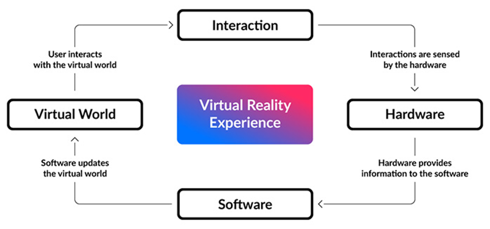
Fig.: An overview of a VR System

Related Technologies

The definitions and explanations of VR and its derivatives are always prone to iterations because of the evolving nature of the domain. In 1994, Paul Milgram and Fumio Kishino define a spectral representation of experiences related to VR called Reality-Virtuality Continuum [1](#ref-1). The spectrum exists between the ideal extremes of a completely virtual world and real world keeping the augmented versions of these in between.

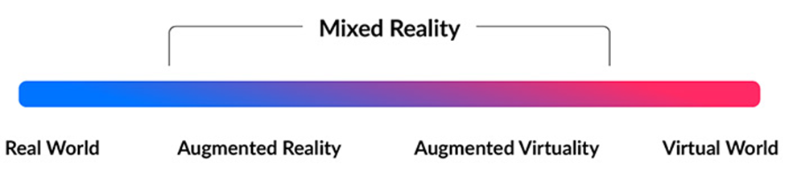
Fig 2. Adopted from Reality-Virtuality Continuum [1](#ref-1)

• Mixed Reality:
The conventional definition of a VR experience refers to when the user is immersed in a completely synthetic world with the help of a system. As the technology progressed to cater different applications, a subclass of experiences related to VR came into existence which required combinations of real and virtual world possibilities. Mixed Reality can be considered as a range of experiences existing between the completely virtual or real extremes of the spectrum. The derivatives of Mixed reality can be augmented forms of the real world by virtual elements (Augmented Reality) or augmented forms of the virtual world by real elements (Augmented Virtuality).

• Augmented Reality:
Augmented Reality can be defined as the experience of actually being present in a real world which is enriched by the virtual entities which are augmented on it with the help of a system. Contrary to the VR experience, here, the reality itself is modified by integrating desired virtual elements into it which opens up various possibilities of interaction.

## Simulation

- https://drive.google.com/file/d/1BQLM_wJ0arqHNnOdRj_Gp64MLF-MKj5S/view?usp=sharing
- https://drive.google.com/file/d/1J5jcLjf9XQJgSHO8BrUkd7CBZ4Uv4yyC/view?usp=sharing
## Posttest
1. What is the primary goal of virtual reality (VR) technology?
---
      A) To simulate real-world experiences and environments for entertainment and training purposes.
---
      B) To create fully autonomous artificial intelligence.
---
      C) To develop advanced gaming consoles.
---
      D) To enhance traditional 2D media consumption.
---
2.  Which of the following is NOT a component essential for a VR system?
---
      A) Head-mounted display (HMD)
---
      B) Motion tracking sensors
---
      C) Game controller
---
      D) VR-ready computer or console
---
3. What distinguishes virtual reality from augmented reality?
---
      A) Augmented reality overlays digital content onto the real world, while virtual reality immerses users in a completely simulated environment.
---
      B) Virtual reality requires specialized hardware, while augmented reality can be experienced using standard smartphones or tablets.
---
      C) Virtual reality is only used for entertainment purposes, while augmented reality is primarily used for practical applications.
---
      D) Augmented reality is a subset of virtual reality, focusing on enhancing digital experiences within virtual environments.
---

## References
 
1. Jason Jerald. 2015. The VR Book: Human-Centered Design for Virtual Reality. Addison-Wesley Professional. 
 
2. William R. Sherman and Alan B. Craig. 2002. Understanding Virtual Reality: Interface, Application, and Design. Morgan Kaufmann Publishers Inc.
 
3. Ronald T. Azuma. 1997. A Survey of Augmented Reality. Presence: Teleoperators and Virtual Environments 6, 4 (August 1997), 355–385. DOI:[https://doi.org/10.1162/pres.1997.6.4.355](https://doi.org/10.1162/pres.1997.6.4.355)
 
4. Frederick P. Brooks Jr. 1999. Virtual Reality: Past, Present, and Future. Computer Graphics and Applications, IEEE 19, 6 (Nov/Dec 1999), 16–25. DOI:[https://doi.org/10.1109/38.799723](https://doi.org/10.1109/38.799723)

## Contributors

Prof. Charu Monga, Media Tech Lab, Department of Design, IIT Delhi

## Feedback