# Virtual Reality Course: CHAPTER 2 - History of Virtual Reality

## AIM

At the end of the course, students will be able to:
- Learn the history of Virtual Reality (VR)
- Learn the historical journey of headsets used in VR
- Learn about the innovators who worked on VR

## Theory

### 1. Introduction to the History of Virtual Reality as a Mode of Communication

The history of virtual reality (VR) is a fascinating journey through the realms of technology, innovation, and human imagination. It spans several decades, marked by key milestones and breakthroughs that have shaped the evolution of VR as we know it today.
In 1965, computer scientist Ivan Sutherland introduced the concept of virtual reality with his groundbreaking work on the "Ultimate Display" at Harvard University. His paper, "The Ultimate Display," published in 1965, laid the theoretical groundwork for immersive virtual environments and interactive computer graphics. [1]. 
Sutherland's vision became a reality in 1968 when he developed the first head-mounted display (HMD), known as the "Sword of Damocles." This device allowed users to experience basic virtual environments, laying the foundation for future VR technologies. [2].
Throughout the 1980s and 1990s, VR gained momentum with the introduction of commercial VR systems by companies like SEGA and Nintendo. SEGA released the SEGA VR headset in the early 1990s, while Nintendo launched the Virtual Boy in 1995, albeit with limited success. [3][4]. 
However, the early promise of VR was met with challenges, leading to a period known as the "Virtual Winter." Technological limitations, high costs, and a lack of compelling content contributed to a decline in public interest in VR during the late 1990s and early 2000s. [5]. 
The turn of the millennium saw a resurgence of interest in VR, fueled by advancements in computing power, graphics technology, and user interfaces. Hollywood blockbusters like "The Matrix" (1999) brought the concept of virtual worlds to mainstream audiences, inspiring a new generation of VR enthusiasts. [6]
In 2012, Palmer Luckey founded Oculus VR, a startup focused on developing affordable and high-quality VR hardware. Oculus Rift, the company's flagship VR headset, garnered widespread attention and acclaim, leading to Facebook's acquisition of Oculus VR in 2014. [7]. Since then, VR has continued to evolve, with major tech companies like HTC, Sony, and Microsoft investing in VR platforms and experiences. From immersive gaming and entertainment to applications in healthcare, education, and beyond, VR has become an integral part of our digital landscape, offering new possibilities for exploration, creativity, and collaboration. [8]

### 2. Communication Media

Communication media refers to the channels or tools used to transmit information. In the context of virtual reality, communication media play a crucial role in relaying immersive experiences, often involving various technologies such as VR headsets, 360-degree videos, and other interactive platforms. As we look at the history of development of communication with virtual reality, it brings us the understanding of various types:

#### a) Stereoscopy:
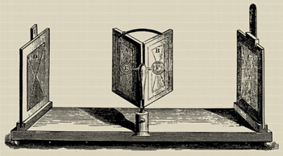

Stereoscopy involves creating an illusion of depth in images or films by presenting slightly offset images to each eye. In VR, stereoscopy contributes to the perception of depth and realism, enhancing the immersive experience by providing a sense of three-dimensionality.

#### b) First Flight Simulator:
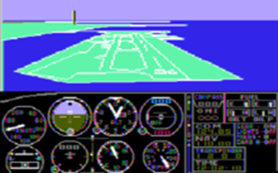

The first flight simulator was created in the early 20th century to train pilots. These early simulators evolved over time and laid the foundation for modern VR technology by simulating real-world experiences in a controlled environment.

#### c) Cinerama:
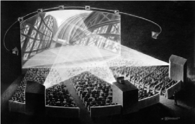

Cinerama was an early widescreen projection system used in filmmaking in the 1950s. It aimed to create an immersive viewing experience by employing multiple synchronized projectors onto a curved screen, giving audiences a wider field of view.

#### d) Sensorama Simulator:

Sensorama was an early attempt at immersive multimedia in the 1960s. It offered a simulated experience through a cabinet-like device that combined stereoscopic 3D images, sound, vibration, and even smells to create a multisensory experience.

#### e) Telesphere Mask:
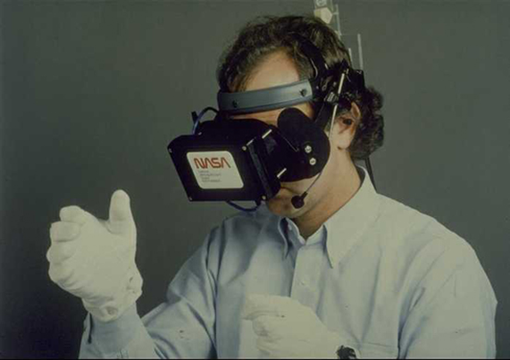

The Telesphere Mask was an early head-mounted display developed in the 1960s. It aimed to immerse users in a virtual environment but was limited in capabilities compared to modern VR headsets.

#### f) The Sword of Damocles - Head Mounted Display:
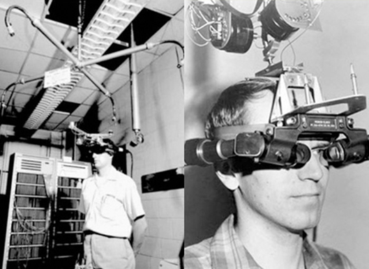

The Sword of Damocles was an early head-mounted display developed by Ivan Sutherland in the 1960s. It was a large, cumbersome device suspended from the ceiling, displaying rudimentary wireframe graphics and laying the groundwork for future HMD technology.

#### g) LEEP Display:
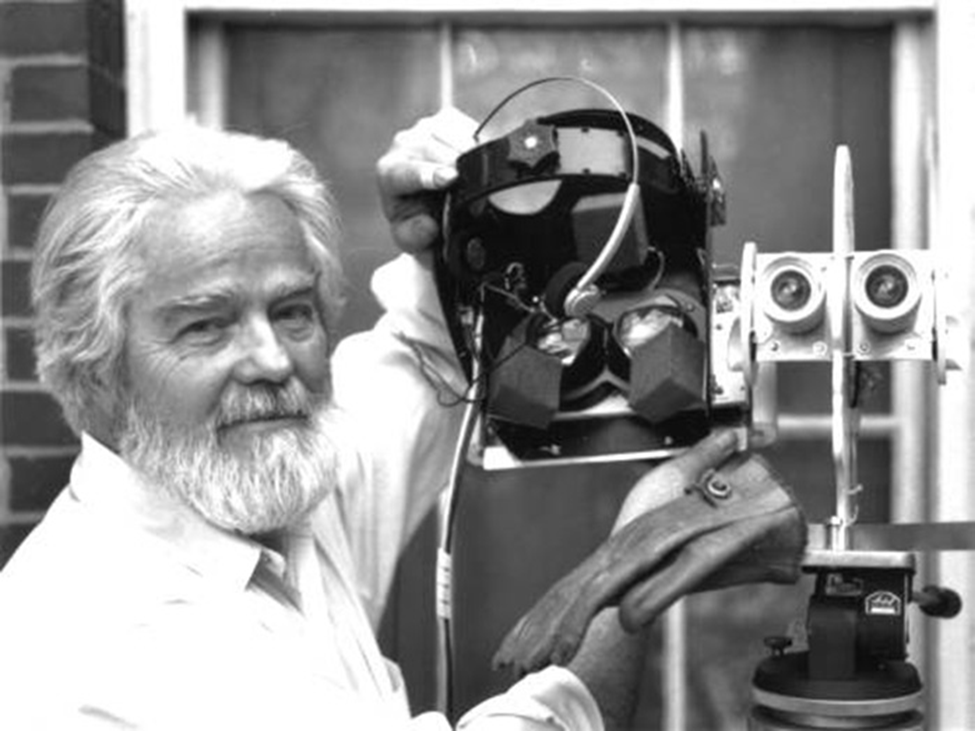

The Large Expanse, Extra Perspective (LEEP) Display was developed in the 1980s and aimed to provide a wide field of view for VR experiences. It contributed to the advancement of immersive visual displays in virtual environments.

#### h) Visual Programming Lab Research (VPL):
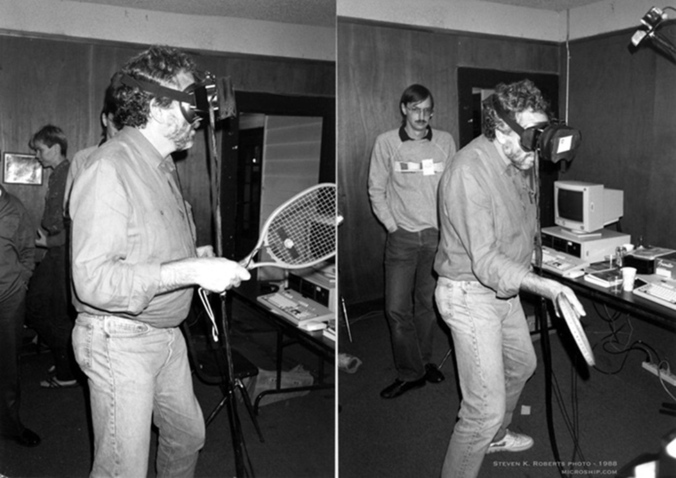

VPL Research was a pioneering company in the 1980s that contributed significantly to early virtual reality. They developed VR-related hardware, software, and devices, including data gloves and early VR systems.

#### i) Virtuality Gaming System:
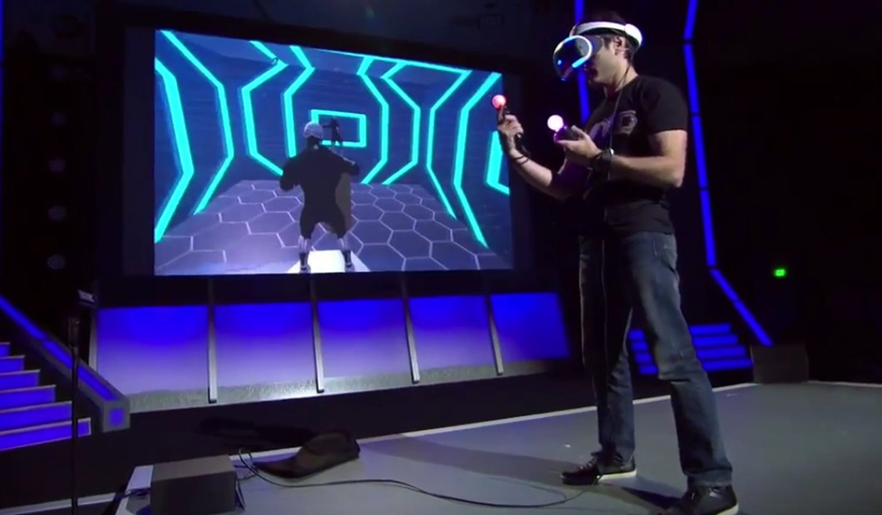

Virtuality was a gaming system popular in the early 1990s, offering immersive VR experiences in arcades. It provided multiplayer gaming and interactive experiences using headsets and hand controllers.

#### j) Cave Automatic Virtual Environment:
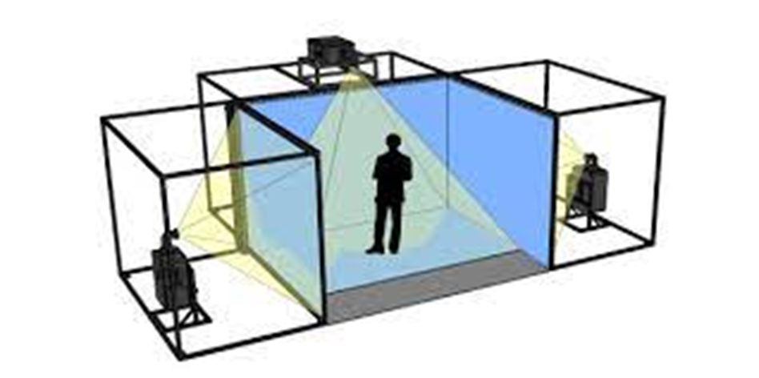

The CAVE is a room-sized VR system comprising multiple walls onto which 3D graphics are projected, allowing users to interact and navigate within a virtual environment.

#### k) SEGA VR Goggles & Nintendo Virtual Boy:
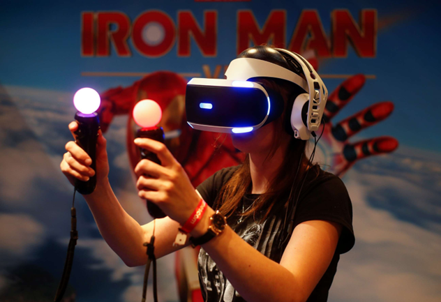

Both SEGA VR Goggles and Nintendo Virtual Boy were early attempts at consumer VR in the 1990s. While ambitious, they faced limitations in technology and were discontinued due to issues such as discomfort and poor visuals.

#### l) Oculus Rift, Google Cardboard, HTC Vive:
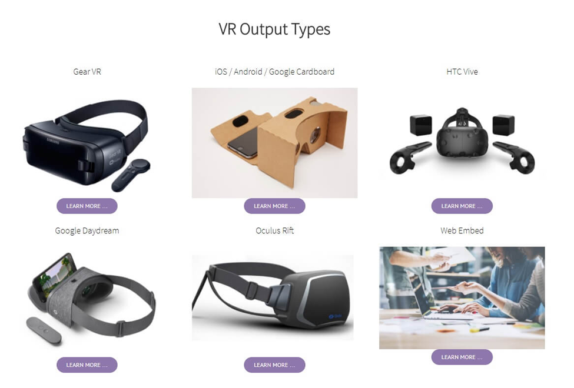

These are modern VR headsets that revolutionized consumer VR. Oculus Rift, developed by Oculus VR (later acquired by Facebook), and HTC Vive offered high-quality, immersive VR experiences. Google Cardboard, on the other hand, aimed to make VR accessible using smartphones and a simple cardboard headset.

#### m) 360 Video:
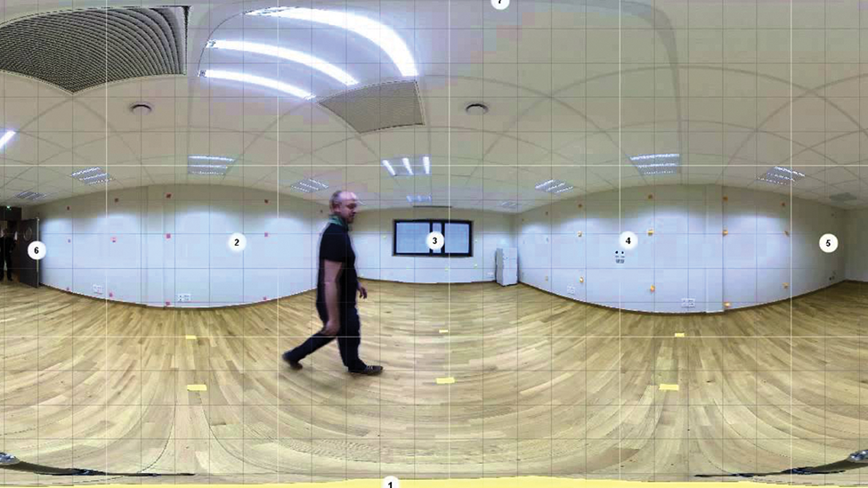

360-degree videos capture footage in all directions, allowing viewers to explore the scene in any direction. They are commonly used in VR experiences, offering immersive storytelling and virtual exploration.

#### n) Standalone VR Headsets:
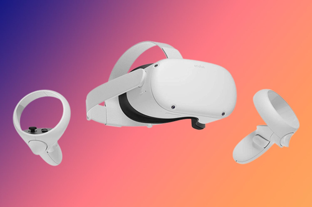

Standalone VR headsets, like Oculus Quest, do not require a PC or external device for operation. They contain all the necessary hardware, making VR more accessible and portable.

#### o) VR and Prospects:
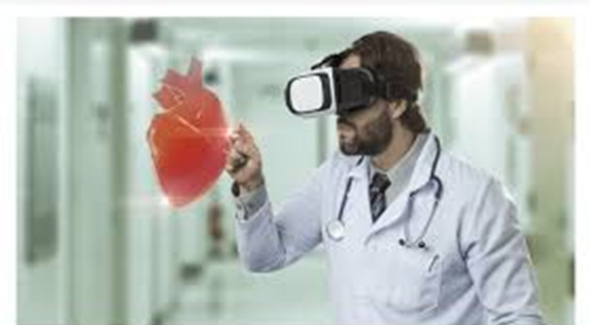

VR continues to evolve with advancements in technology, offering vast potential in various fields such as gaming, education, healthcare, training, and more. As technology improves, VR is becoming more immersive, affordable, and accessible to wider audiences, promising exciting prospects for its future applications and growth.

---

## Pretest: History of Virtual Reality

1. Who is considered the "Father of Virtual Reality"?
    a) John Carmack
    b) Ivan Sutherland
    c) Palmer Luckey
    d) Tim Berners-Lee

2. In what year did Ivan Sutherland develop the first virtual reality head-mounted display (HMD)?
    a) 1955
    b) 1968
    c) 1983
    d) 1996

3. Which groundbreaking virtual reality system was released by Nintendo in the 1990s?
    a) PlayStation VR
    b) Oculus Rift
    c) Virtual Boy
    d) HTC Vive

### Answers:
1. b) Ivan Sutherland  </code>
2. b) 1968  </code>
3. c) Virtual Boy </code>
---

## Procedure

Check the functionality of the latest VR Headset by moving the slider.

Click on the next button to choose the head-mounted display.

### Simulation
Make a slider of virtual reality headsets and set up the experiment.  
This approach is using Unity3D, a popular game engine for VR development.  
1. Create a new Unity project or open an existing one and then set up your VR scene with the necessary environment and objects.  
2. Add a 3D object such as a cube or cylinder to represent the slider handle and position the slider object appropriately within your scene.  
3. Attach a script to the slider object to handle user interaction.  
4. Use input from the VR controllers (e.g., Oculus Touch controllers) to detect when the user grabs and moves the slider.  
5. Update the position of the slider handle based on the user's input.  
6. Define the minimum and maximum values that the slider can represent.  
7. Check the VR controllers to enhance the user experience, and also check the current value of the slider.  
8. Test the slider interface in VR to ensure that it works as intended. Modify if necessary.  
9. (Remember to attach this script to the slider object in your Unity scene and configure the script's properties as required. Test the slider interface in VR to ensure it behaves as expected and refine it as needed for optimal usability).

---

## Post Test

1. What was the name of the virtual reality system developed by SEGA in the 1990s?
    a) SEGA VR
    b) Dreamcast VR
    c) SEGA Saturn VR
    d) SEGA Genesis VR

2. What term is often used to describe the period in the 1990s when virtual reality experienced a surge in public interest followed by a decline?
    a) Virtual Revolution
    b) VR Boom
    c) Cyber Age
    d) Virtual Winter

3. Which movie released in 1999 portrayed a dystopian future where humans interacted in a virtual reality world called the Matrix?
    a) The Truman Show
    b) Inception
    c) The Matrix
    d) Avatar

4. What was the name of the virtual reality startup founded by Palmer Luckey, which later developed the Oculus Rift?
    a) V-Ring
    b) Oculus VR
    c) Virtuality Inc.
    d) Virtuix

5. What year did Facebook acquire Oculus VR, the company behind the Oculus Rift?
    a) 2012
    b) 2014
    c) 2016
    d) 2018

6. Which of the following is NOT a major component of virtual reality systems?
    a) Haptic feedback devices
    b) Motion tracking sensors
    c) Neural implants
    d) Stereoscopic displays

7. True or False: Virtual reality technology has primarily been used for gaming and entertainment purposes.

### Answers:
1. a) SEGA VR  
2. d) Virtual Winter  
3. c) The Matrix  
4. b) Oculus VR  
5. b) 2014  
6. c) Neural implants  
7. False

---

## References
1. Sutherland, I. (1965). *The Ultimate Display*. Proceedings of the International Federation of Information Processing Congress (IFIP '65).  
2. Sutherland, I. (1968). *A Head-Mounted Three Dimensional Display*. Proceedings of the Fall Joint Computer Conference (AFIPS '68).  
3. SEGA VR. (n.d.). Retrieved from [https://segaretro.org/Sega_VR](https://segaretro.org/Sega_VR)  
4. Virtual Boy. (n.d.). Retrieved from [https://www.nintendo.co.uk/Corporate/Nintendo-History/Nintendo-History-625945.html](https://www.nintendo.co.uk/Corporate/Nintendo-History/Nintendo-History-625945.html)  
5. Lanier, J. (2017). *Dawn of the New Everything: A Journey Through Virtual Reality*. Henry Holt and Co.  
6. *The Matrix* (1999). Directed by The Wachowskis. Warner Bros. Pictures.  
7. Oculus VR. (n.d.). Retrieved from [https://www.oculus.com/](https://www.oculus.com/)  
8. Bailenson, J. N. (2018). *Experience on Demand: What Virtual Reality Is, How It Works, and What It Can Do*. W. W. Norton & Company.

---

## Contributors

Prof. Charu Monga, Media Tech Lab, Department of Design, IIT Delhi

---

## Feedback
