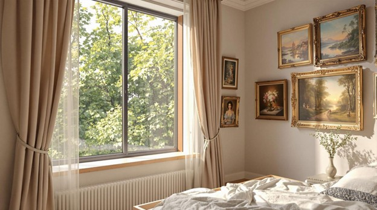
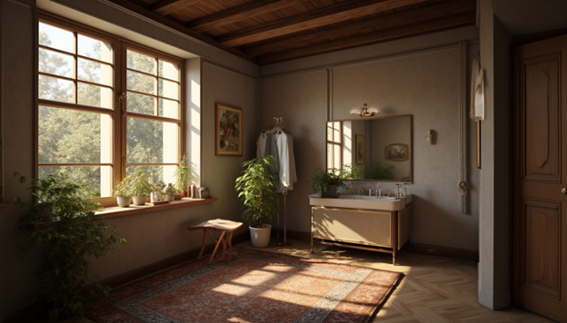
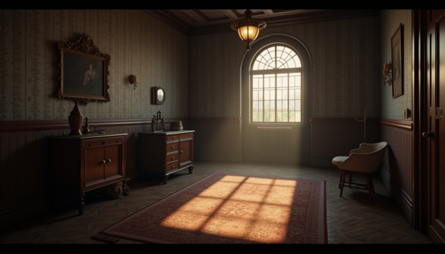
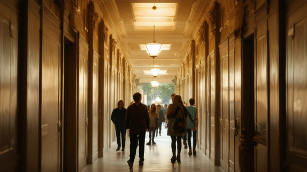
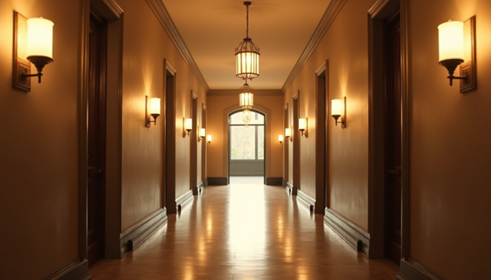
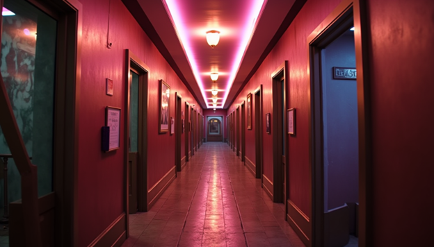
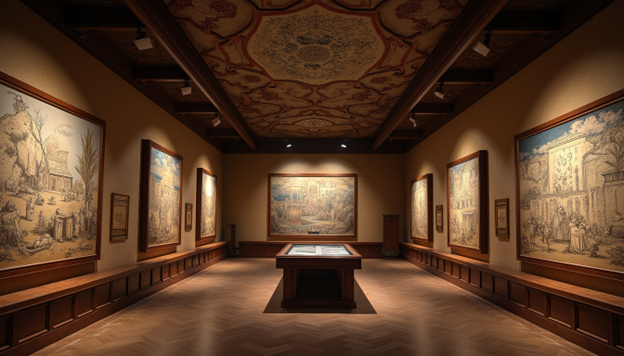
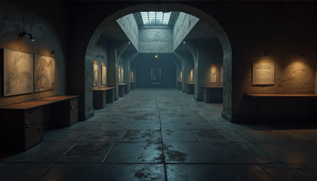

# Virtual Reality Course

## CHAPTER 8: Understanding Lighting in Virtual Reality

### AIM
To understand the use of lighting in virtual reality.

### Theory
Lighting plays a crucial role in Virtual Reality (VR), significantly impacting realism, immersion, mood, and user experience. A well-lit VR environment can make the virtual world feel more lifelike by accurately simulating how light interacts with objects, surfaces, and spaces. For instance, natural sunlight streaming through a window in a VR home simulation creates a sense of warmth and familiarity, while flickering neon signs in a cyberpunk city add to the futuristic atmosphere.

Beyond realism, lighting also helps set the mood and tone of a scene. Warm, soft lighting can evoke a sense of comfort and relaxation, perfect for a VR meditation app, while dim, eerie lighting in a horror game builds suspense and tension. It also enhances storytelling by guiding users emotionally—think of how a sudden change from bright daylight to deep shadows can signal an upcoming dramatic moment.

Depth perception in VR is another key aspect influenced by lighting. Shadows, highlights, and gradients help users understand spatial relationships within a scene. For example, in a VR escape room, soft shadows cast by furniture and objects help define their shapes and distances, making navigation more intuitive. Additionally, lighting is an effective tool for directing user attention. Spotlights can highlight interactive objects in a puzzle game, while well-lit pathways naturally guide players toward objectives in an open-world experience.

Interactivity further enhances realism in VR through dynamic lighting that reacts to user actions. A flashlight illuminating dark corners as a player explores a haunted house or car headlights adjusting as a user navigates a virtual city are perfect examples of how real-time lighting makes VR experiences feel responsive and immersive. However, achieving realistic lighting while maintaining smooth performance requires optimization. Techniques like baked lighting—where shadows and global illumination are precomputed—ensure high-quality visuals without overloading the hardware, making it ideal for static environments like architectural walkthroughs.

Different types of lights serve unique purposes in VR. Directional light simulates sunlight and affects an entire scene uniformly, while point lights, like bulbs, cast illumination in all directions from a specific point. Spotlights create focused beams, useful for stage lighting or flashlights in dark settings. Ambient light ensures no part of a scene is entirely dark, providing a base level of illumination, while area lights mimic large sources like windows or ceiling panels for a more natural look. Advanced techniques such as global illumination simulate how light bounces off surfaces, adding realism by creating soft lighting and natural shadows. Volumetric lighting, like sunlight streaming through a dusty window, enhances atmosphere and visual depth.

Shadows also contribute to realism in VR. Hard shadows have sharp edges, like those cast by a bright midday sun, while soft shadows, seen on a cloudy day, have diffused edges for a more natural look. Color temperature plays a role in setting the mood—warm hues (yellow, orange) create a cozy environment, while cool tones (blue, white) convey a sterile or futuristic feel, such as in a VR medical simulation. Special lighting effects further enrich the experience—flickering lights add tension in horror games, dynamic color shifts match story progression, and realistic reflections and refractions bring elements like water and glass to life.

High Dynamic Range (HDR) lighting enhances contrast between bright and dark areas, making outdoor scenes in VR appear more natural. Since VR hardware has performance limitations, optimized techniques like lightmaps and Level of Detail (LOD) ensure smooth performance without sacrificing visual quality. Developers use various tools to achieve these effects. Unity offers baked and real-time lighting tools, Unreal Engine provides advanced systems like ray tracing for hyper-realistic illumination, and Blender helps pre-light 3D models before importing them into VR environments.

Ultimately, lighting is one of the most powerful tools in VR design, shaping not just how a world looks but how users feel and interact with it. Whether it’s the soft glow of a sunset in a virtual beach retreat or the ominous flicker of a streetlamp in a dystopian city, lighting breathes life into virtual spaces, making them more engaging and believable.

### Pre Test
**Lighting in VR**

4. What does directional lighting in VR simulate?    
    A. A bulb in a room.    
    B. Sunlight or a distant light source. ✅    
    C. A torchlight beam.    

5. Why is dynamic lighting important in VR?    
    A. To improve rendering speed.    
    B. To respond to user interactions in real time. ✅    
    C. To reduce color complexity.    

6. What is the purpose of volumetric lighting in VR?    
    A. To create visible light beams and enhance mood. ✅    
    B. To reduce shadows.    
    C. To create sharp-edged highlights.    

### Procedure

**Simulation**  
[Watch the Simulation Video](https://youtu.be/fsjzhZ7yCdk)
<iframe width="560" height="315" src="https://youtu.be/fsjzhZ7yCdk" frameborder="0" allow="accelerometer; autoplay; encrypted-media; gyroscope; picture-in-picture" allowfullscreen></iframe>

### Posttest
**Lighting in VR**

4. What is the benefit of using baked lighting in VR?    
    A. To improve performance in static environments. ✅    
    B. To create dynamic effects.    
    C. To eliminate shadows.    

5. How does global illumination enhance VR environments?    
    A. By creating soft lighting and realistic shadows. ✅    
    B. By eliminating all reflections.    
    C. By reducing rendering time.    

6. What is a common use of HDR lighting in VR?    
    A. Enhancing contrast between bright and dark areas. ✅    
    B. Flattening the visual depth.    
    C. Removing high-contrast elements.    
    D. By adding more shadows.    

### References

1. Smith, J. (2021). *Mastering Camera Angles and Color Psychology in Virtual Reality*. New York: Virtual Press.
2. Johnson, R. (2019). *The Art of Visual Storytelling: Using Camera Angles and Color in Virtual Reality*. Los Angeles: VR Publishing.
3. Lee, S., & Kim, H. (2020). *Understanding Color Psychology and Camera Angles for Immersive Virtual Reality Experiences*. Journal of Virtual Reality Studies, 15(2), 123-140.
4. Chen, L., & Wang, Y. (2018). *Visual Clarity in Virtual Reality: The Role of Camera Angles and Color Selection*. International Conference on VR Technology Proceedings, 78-91.
5. Garcia, M., & Jones, T. (2017). *The Impact of Camera Angles and Color Psychology on User Engagement in Virtual Reality Environments*. Journal of Immersive Technologies, 6(3), 210-225.

### Contributors
Prof. Charu Monga, Media Tech Lab, Department of Design, IIT Delhi

### Feedback
